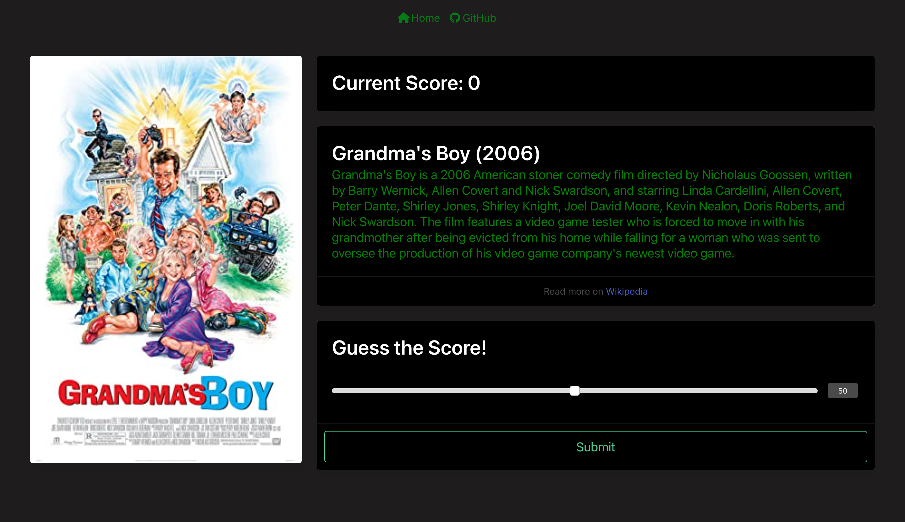
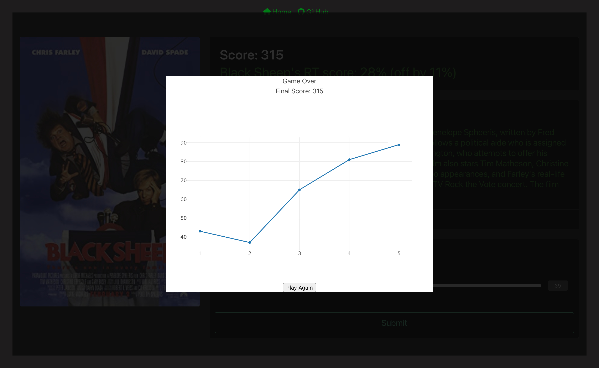

# Rotten Tomatoes Movie Review Guesser

- First, shoutout to the collaborators, Jacob Boyce, Kipp Cavner, Casen Sutherland, and Jon Guhl.
- Here we have a game that allows you to guess Rotten Tomatoes review scores.
- Through fetching the OMDB API and the Wikipedia API we have parsed information that will display the movie poster, information about the movie, and behind the scenes will keep a log of the correct review score to comprate to the user input.

## Usage 

- Now you can deploy the page https://jboyce313.github.io/movie-game/
- The page should look like this when deployed 
- 
- From here you can either hit the 'Start Button' to start the game or you can check out the collaborators repositories by clicking their individual buttons at the bottom of the landing page. 
- Once you click the 'Start Button' you will be directed to a new browser that looks like this 
- 
- From here you should the browser will display a movie poster, your current score in the game, a little bit of info about the movie, and you will have a slider bar that with a number input that will allow you to guess what you think the review score more the movie is.
- Under the information about the movie you can click the Wikipedia link and you will be directed to the wikipedia page about the movie. 
- The highest score you can receive for a guess is 100 points. We are taking the difference between the  actual review score and the score you guessed by subtracting the difference you have by 100 points. So if there is no difference you receive 100 points for your guess. 
- After you have guessed you will be given a whole new movie to guess and the difference of your previous guess will be displayed under your score.
- The game will stop after 5 movies have been guessed and then a modal be displayed showing the score via a plot chart like so 
- 
- From there you can hit the play again button to play the game again if you wish

## Credits
- The background image for the landing page was grabbed from www.wallpapers.com 
- The movie poster and review score were fetched using the OMDB API https://www.omdbapi.com/
- The small bit information about the movie was fetched from the Wikipedia API https://www.mediawiki.org/wiki/API:Main_page

